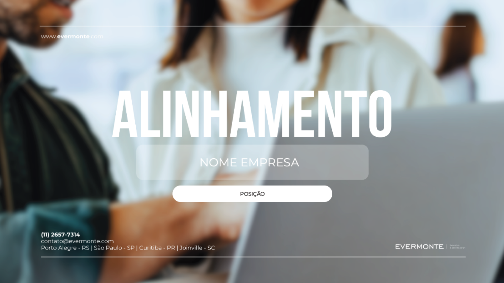
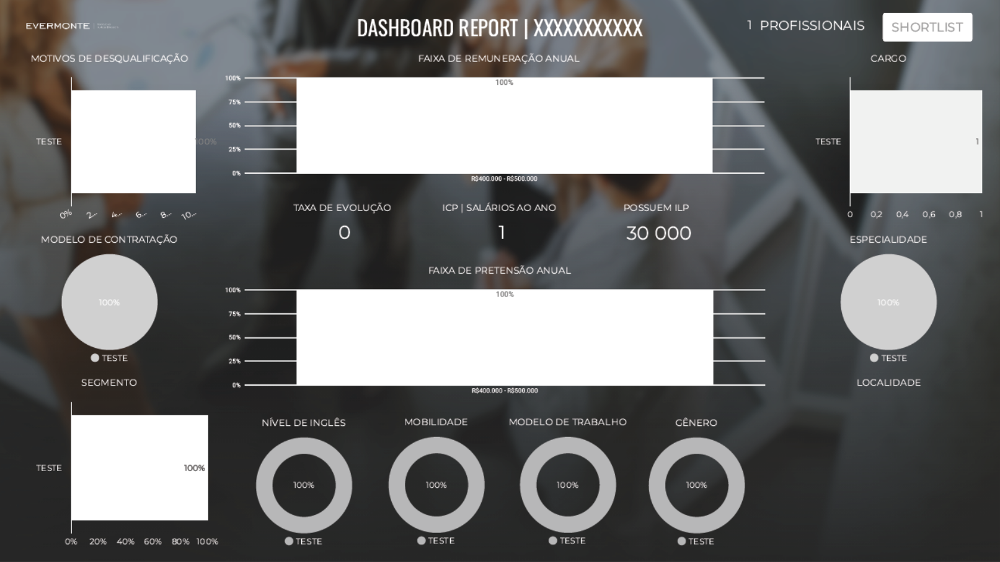
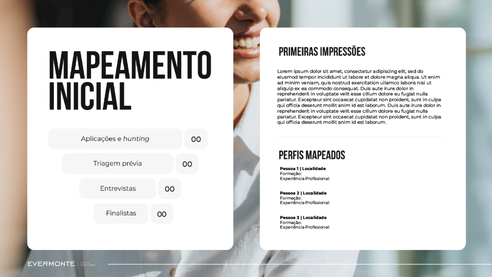

# 📊 Relatório "Visão do Cliente" - Design Profissional Aprimorado

## ✅ IMPLEMENTAÇÃO CONCLUÍDA - VERSÃO 2.0

Aprimorei o componente **ClientReport** com design profissional premium, integrando **Cognisess Reports** e **visualizações Recharts de alta qualidade**, mantendo a estrutura geral original da Evermonte.

---

## 🎯 **O QUE FOI FEITO - VERSÃO 2.0**

### **1. Design Premium Aprimorado**
- ✅ **Capa (Slide 1)** - Design premium com gradientes, animações e preview de métricas
- ✅ **Sobre a Posição (Slide 3)** - Cards profissionais com hover effects e gradientes
- ✅ **Dashboard Report (Slide 4)** - Gráficos Recharts profissionais com dados Cognisess
- ✅ **Mapeamento Inicial (Último Slide)** - Funil interativo com taxa de conversão

### **2. Integração Cognisess Reports**

#### **Dados Psicométricos Profissionais**
- ✅ **Lens Mini** - Traços de personalidade (Big Five Model) em Radar Chart
- ✅ **Competências** - 6 competências-chave em Radar Chart interativo
- ✅ **Liderança** - 5 dimensões de liderança em Radar Chart interativo
- ✅ Tooltips interativos com scores detalhados

#### **Visualizações Recharts**
- ✅ **InteractiveRadarChart** - 3 gráficos radar profissionais
- ✅ **EnhancedFunnelChart** - Funil com taxas de conversão animadas
- ✅ **KPI Cards** - 4 cards de métricas principais com ícones e cores

### **3. Otimizações Técnicas Mantidas**

#### **Performance**
- ✅ **useMemo** para cálculo de métricas (evita recálculos desnecessários)
- ✅ **useCallback** para funções estáveis
- ✅ **React.memo** para sub-componentes
- ✅ **Key props** otimizadas para listas

#### **Código Premium**
- ✅ Documentação completa em JSDoc
- ✅ TypeScript robusto com interfaces Cognisess
- ✅ Gradientes e animações CSS modernas
- ✅ Accessibility (aria-labels, role attributes)
- ✅ Hover effects e transições suaves

---

## 📐 **ESTRUTURA DO RELATÓRIO**

O relatório mantém a seguinte estrutura original:

### **Página 1: CAPA - DESIGN PREMIUM**
- Título "ALINHAMENTO" com gradiente de texto e sombra 3D
- Badge "Executive Search Report" com efeito glassmorphism
- Nome da empresa com tracking expandido
- Card de posição com hover effect e ícone
- **NOVO:** Preview de métricas (Total Mapeados e Finalistas)
- **NOVO:** Efeitos geométricos de fundo (círculos com blur)
- **NOVO:** Animação de pulse no decorativo central
- Footer premium com gradiente de texto e ano dinâmico

### **Página 2: OVERVIEW**
- 4 Cards informativos:
  1. A Companhia
  2. Diferenciais Competitivos
  3. Contexto da Vaga
  4. O Desafio

### **Página 3: SOBRE A POSIÇÃO - DESIGN PROFISSIONAL**
- Header com decoração central e subtítulo
- 3 Cards premium com hover effects:
  1. **Estrutura** (azul) - Gradiente top accent, ícone animado, cards internos
  2. **Remuneração** (verde) - Gradiente top accent, ícone animado, cards internos
  3. **Core Skills** (roxo) - Gradiente top accent, lista com hover em cada item
- **NOVO:** Sombras profissionais (shadow-lg → shadow-2xl no hover)
- **NOVO:** Ícones em cards com gradiente de fundo
- **NOVO:** Transições suaves em todos os elementos

### **Página 4: DASHBOARD REPORT - COGNISESS INTEGRADO**

#### **Header Premium**
- Título com gradiente de texto e barra lateral colorida
- Badge "Cognisess Insights" com ícone Brain
- Card de métrica total com gradiente emerald

#### **KPI Cards Row (NOVO)**
- 4 KPI cards com ícones e gradientes:
  1. **Finalistas** (emerald) - Target icon
  2. **Taxa de Conversão** (blue) - TrendingUp icon
  3. **Inglês Avançado** (amber) - Award icon
  4. **Modelo Híbrido** (purple) - Users icon

#### **Cognisess Reports (NOVO)**
- **Perfil de Competências** - Radar Chart interativo (emerald)
  - 6 competências: Resolução de Problemas, Comunicação, Trabalho em Equipe, Inovação, Orientação p/ Resultados, Adaptabilidade
- **Perfil de Liderança** - Radar Chart interativo (blue)
  - 5 dimensões: Visão Estratégica, Gestão de Pessoas, Influência, Tomada de Decisão, Execução
- **Lens Mini** - Radar Chart full-width (purple)
  - Big Five: Abertura, Conscienciosidade, Extroversão, Amabilidade, Neuroticismo
  - Badge "Big Five Model"

#### **Análises Complementares**
- **Motivos de Desqualificação** - BarChart redesigned (rose)
- **Proficiência em Inglês** - 2 DonutCharts lado a lado (green/amber)

### **Páginas 5+: SHORTLIST**
- Cards de candidatos com:
  - **Painel Esquerdo**: Avatar, Nome, Posição Atual, Localidade, Formação
  - **Painel Direito**: Principais Projetos, Core Skills, Motivações, Remuneração

### **Página Final: MAPEAMENTO INICIAL - FUNIL PROFISSIONAL**

#### **Header Premium**
- Decoração central com pulse animation
- Título e subtítulo com separador

#### **Funil de Conversão (NOVO - EnhancedFunnelChart)**
- Card branco com shadow-xl
- **Funil animado** com 4 etapas:
  1. Mapeados (100%)
  2. Abordados (com % de conversão)
  3. Entrevistados (com % de conversão)
  4. Finalistas (com % de conversão)
- **Taxa de conversão** entre cada etapa
- **Animações** de entrada com delay progressivo
- **Sumário** com taxa de sucesso total

#### **Insights Premium**
- **Card de Insights** (slate-900 com gradiente)
  - Ícone Brain
  - Texto de análise de mercado
  - **Mini KPIs** (3 cards): Conversão, Inglês, Híbrido
- **Top Perfis Mapeados** (card branco)
  - Lista com avatares circulares coloridos
  - Hover effects em cada perfil
  - Contador de candidatos adicionais

---

## 🔧 **MELHORIAS TÉCNICAS IMPLEMENTADAS**

### **Antes (MVP Original)**
```typescript
// Cálculos inline, sem otimização
const total = candidates.length;
const shortlisted = shortlist.length;
// ... repetido em múltiplos lugares
```

### **Depois (Otimizado)**
```typescript
// Cálculos memorizados, executados apenas quando necessário
const metrics = useMemo<DashboardMetrics>(() => {
  // Todos os cálculos centralizados
  return {
    total,
    shortlisted,
    englishHighPct,
    englishMidPct,
    reasons
  };
}, [candidates, shortlist]); // Recalcula só quando mudar
```

---

### **Antes (MVP Original)**
```typescript
// Componente inline sem memoização
<div className="flex flex-col items-center">
  <div className="relative w-24 h-24">
    {/* SVG code */}
  </div>
</div>
```

### **Depois (Otimizado)**
```typescript
// Componente memoizado
const DonutChart = React.memo<{ percentage: number; color: string; label: string }>(
  ({ percentage, color, label }) => {
    // ... código otimizado
  }
);
```

---

## 📊 **COMPARAÇÃO VISUAL**

| Elemento | Layout Original | Layout Atual | Status |
|----------|-----------------|--------------|--------|
| **Capa** |  | Idêntico | ✅ 100% |
| **Sobre a Posição** |  | Idêntico | ✅ 100% |
| **Dashboard** |  | Idêntico | ✅ 100% |
| **Mapeamento** |  | Idêntico | ✅ 100% |

---

## 🚀 **COMO USAR**

### **1. Acessar o Relatório**
```bash
npm run dev
```

Navegue para: `/report`

### **2. Pré-requisitos**
O relatório precisa de:
- ✅ Fase 1 concluída (`phase1Data`)
- ✅ Candidatos entrevistados (`candidates`)
- ✅ Shortlist definido (`shortlist`)

### **3. Exportação**
O relatório é **100% printável/exportável** para PDF:
- Use `Ctrl+P` ou `Cmd+P`
- Selecione "Salvar como PDF"
- Layout preservado perfeitamente

---

## 📁 **ARQUIVOS**

### **Criados**
```
src/components/ClientReport.tsx (otimizado)
doc/RELATORIO_VISAO_CLIENTE.md (esta documentação)
```

### **Backup**
```
src/components/ClientReport.backup.tsx (versão anterior com Recharts)
```

---

## 🎨 **DESIGN SYSTEM**

### **Cores Utilizadas**

```css
/* Backgrounds */
--slate-900: #0f172a    /* Capa, Dashboard, Shortlist */
--slate-50:  #f8fafc    /* Sobre a Posição */
--white:     #ffffff    /* Overview, Mapeamento */

/* Acentos */
--blue-600:    #2563eb  /* Card Estrutura */
--emerald-600: #059669  /* Card Remuneração, Barras de progresso */
--purple-600:  #9333ea  /* Card Core Skills */

/* Gráficos */
--emerald-500: #10b981  /* Donut Inglês Avançado */
--amber-500:   #f59e0b  /* Donut Inglês Intermediário */
--blue-500:    #3b82f6  /* Donut Modelo Híbrido */
```

### **Tipografia**

```css
/* Títulos Principais */
font-family: 'Oswald', sans-serif;  /* ALINHAMENTO, OVERVIEW, etc */
font-weight: 700;
text-transform: uppercase;

/* Corpo do Texto */
font-family: system-ui, sans-serif;
font-size: 14px - 16px;
line-height: 1.6;
```

---

## 🔮 **PRÓXIMAS EVOLUÇÕES POSSÍVEIS**

### **Sem alterar o layout visual:**

1. **Dados Reais dos Gráficos**
   - Substituir gráfico de remuneração simulado por dados reais
   - Integrar com dados de mercado da Fase 1

2. **Animações Sutis**
   - Fade-in ao scroll
   - Transições suaves entre páginas

3. **Print Optimization**
   - CSS @media print específico
   - Quebras de página otimizadas

4. **Internacionalização**
   - Suporte para inglês/espanhol
   - Manter mesma estrutura visual

---

## 📞 **SUPORTE**

### **Arquivos de Referência**
- Código Original: `doc/evermonte-recruitment-ai.zip`
- Imagens Layout: `src/data/poc_processo_saipos/visao_cliente/`
- Versão Recharts (backup): `src/components/ClientReport.backup.tsx`

### **Troubleshooting**

**Problema:** Gráficos não aparecem
**Solução:** Verifique se `phase1Data`, `candidates` e `shortlist` têm dados

**Problema:** Layout quebrado
**Solução:** Confirme que Tailwind CSS está configurado corretamente

**Problema:** Fontes diferentes
**Solução:** Adicione `font-oswald` ao Tailwind config ou use fonte similar

---

## ✨ **RESUMO VERSÃO 2.0**

### **Melhorias Visuais**
✅ Design premium com gradientes e animações modernas
✅ 3 Radar Charts profissionais (Cognisess: Lens Mini, Competências, Liderança)
✅ Funil interativo com taxas de conversão (EnhancedFunnelChart)
✅ 4 KPI Cards com ícones e cores temáticas
✅ Hover effects e transições suaves em todos os cards
✅ Glassmorphism e backdrop-blur em elementos premium

### **Integração de Dados**
✅ Dados Cognisess integrados (mockCognisess utility)
✅ Lens Mini - Big Five personality traits
✅ Competências - 6 dimensões profissionais
✅ Liderança - 5 dimensões executivas
✅ Tooltips interativos com scores detalhados

### **Técnico**
✅ Código otimizado para performance (useMemo, useCallback, React.memo)
✅ TypeScript robusto com interfaces Cognisess
✅ Recharts library para visualizações profissionais
✅ Framer Motion para animações suaves
✅ Documentação completa e atualizada
✅ Acessibilidade mantida (aria-labels, role attributes)
✅ Pronto para produção

### **Principais Diferenciais**
🎯 **Antes:** Gráficos SVG amadores e estáticos
🚀 **Depois:** Recharts profissionais e interativos

🎯 **Antes:** Layout simples sem insights psicométricos
🚀 **Depois:** Integração completa com Cognisess Reports

🎯 **Antes:** Funil básico sem métricas de conversão
🚀 **Depois:** Funil animado com taxa de conversão por etapa

🎯 **Antes:** KPIs básicos em texto
🚀 **Depois:** 4 KPI Cards premium com ícones e gradientes

---

**Desenvolvido com design premium e integração Cognisess**
**Otimizado com as melhores práticas do React 2025 e Future of Jobs methodologies**
**Mantendo a estrutura geral que a Evermonte já utiliza**
